<style type="text/css">
.title-slide {
  background-color: #EDEDED; 
}
article p {
  text-align:left;
}
p {
  text-align:left;
}
ul li {
  text-align:left;
}
img {     
  max-width: 90%;
  max-height: 90%;
  vertical-align: middle;
}
</style>

<script type="text/javascript" src="http://ajax.aspnetcdn.com/ajax/jQuery/jquery-1.7.min.js"></script>
<script type="text/javascript">
$(function() {     
  $("p:has(img)").addClass('centered'); 
  });
</script>
 

## Exciting Time to be Doing Large-Scale Scientific Computing

Large scale scientific computing, 1995-2005 (ish):

* ~20 years of stability
* Bunch of x86, MPI, ethernet or infiniband
* No one outside of academia was much doing big number crunching

--- &twocol

## New Communities Make things Exciting!

*** =left

* Internet-scale companies (Yahoo!, Google)
* Very large-scale image processing
* Machine learning:
  * Sparse linear algebra
  * k-d trees
  * Calculations on unstructured meshes (graphs)
  * Numerical optimization
* Building new frameworks

*** =right

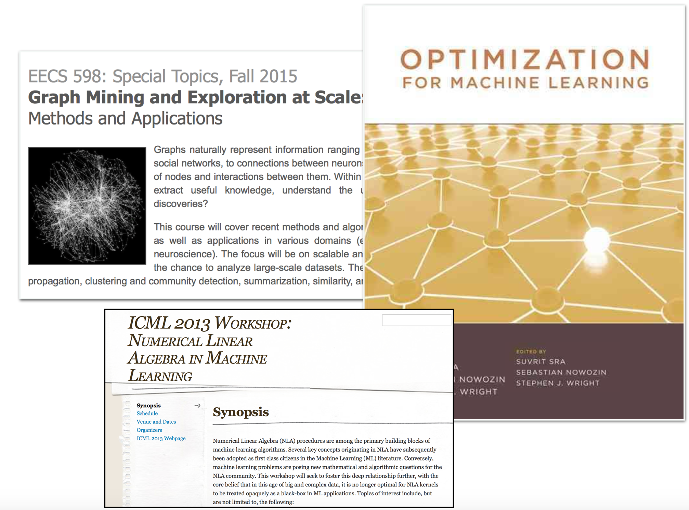

--- &twocol

## New Hardware Makes things Exciting!

*** =left

* Now:
  * Large numbers of cores per socket
  * GPUs/Phis
* Next few years:
  * FPGA (Intel: Broadwell + Arria 10, shipping 2017)
  * Non-volatile Memory (external memory/out-of-core algorithms)

*** =right


---

## New Hardware Makes things Exciting?


---

## New Hardware Makes things Exciting?


---

## New Hardware Makes things Exciting?

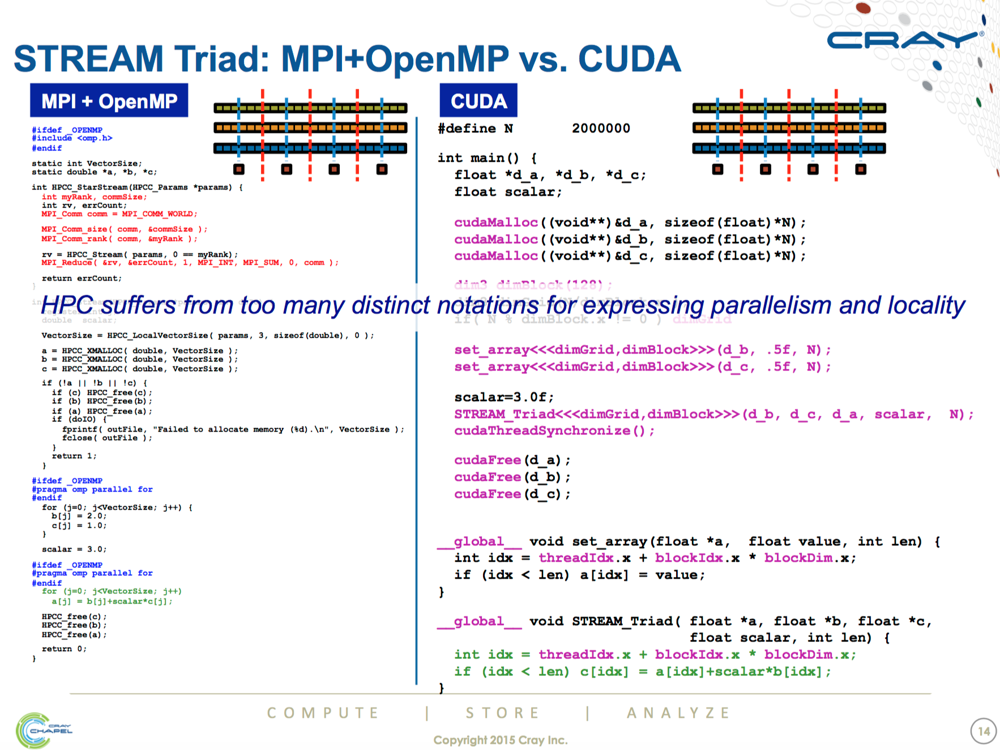

---

## Programming Time is More Precious Than Compute


--- &twocol

## Programming Time is More Precious Than Compute

*** =left

And this only becomes more pronounced with other trends which make scientific programming harder:

* New variations of hardware
* New science demands: cutting edge models are more complex.  An Astro example:
    * 80s - gravity only N-body, galaxy-scale
    * 90s - N-body, cosmological
    * 00s - Hydrodynamics, cosmological
    * 10s - Hydrodynamics + rad transport + cosmological
    
*** =right


--- &twocol

## Things are currently harder than they have to be

*** =left

_Computational_ scientists have learned a lot about _computer_ science in the last 20+ years.
* Encapsulation
* Higher level programming languages (_e.g._, python-as-glue)
* Code collaboration, sharing (github, etc)
* Division of labour - more distinction between people who work on libraries and people who build software that implements a scientific model

*** =right


--- &twocol

## We're programming at the transport layer...

*** =left

But our frameworks are letting us down.

MPI, which has served us very well for >25 years, is 90+% low level.  
* "Send 100 floats to task 7"
* Close to a network-agnostic sockets API (So maybe network level)
    - But a sockets API where everyone's browser crashes if a web server goes down.
* Assumptions made to make it easy for scientists to directly program in make it very difficult to build general frameworks upon (new MPI-3 one-sided stuff being an honourable exception)

*** =right


--- &twocol

## When we want to think about models, systems

*** =left

Programming at that level is worse than just hard.
* Makes the code very resistant to change.
* Changing how the data is distributed means completely rewriting every line of code that assumes the current distribution, communications pattern.
* &ldquo;I have an idea! I _think_ it will speed up the code 25%!  But it means rewriting 50,000 lines of code.&rdquo;
    - \#ExperimentsThatWillNeverHappen
* Makes it hard to take advantage of the opportunities new technologies present.

*** =right

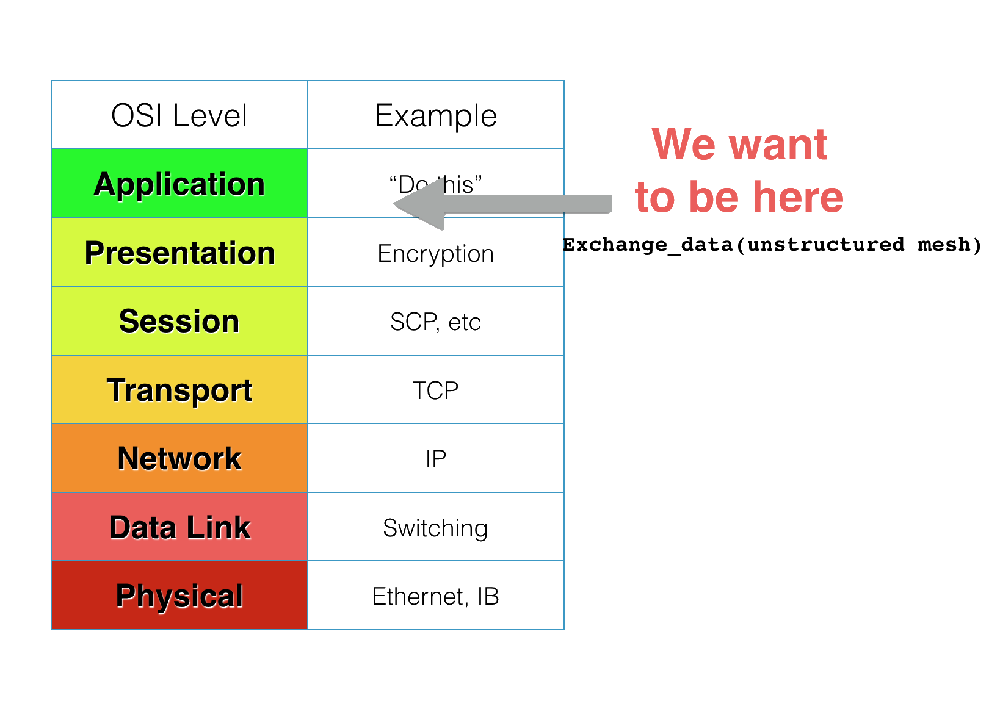

---

## We know things can be better, from...

There have been many projects from within scientific computing that have tried to provide a higher-level approach - most have not been wildly successful.

* Many were focussed to specifically on one kind of problem (HPF)
* Or solved one research group's problems but people working in other areas weren't enthusiastic (Charm++)

But new communties are reawakining these efforts with the sucesses they're having with their approaches.

And we know we can have _both_ high performance and higher-level primitives from a parallel library I use pretty routinely.  

It's called MPI.

--- &twocol

## We know things can be better, from MPI

*** =left

**Collective** operations - scatter, gather, broadcast, or interleave data from all participating tasks.

Are implemented with:
* Linear sends
* Binary trees
* Split rings
* Topology aware
...

Make decisions about which to use size of communicator, size of message, etc without researcher intervention.

Can influence choice with implementation-dependant runtime options.

*** =right


--- &twocol

## We know things can be better, from MPI

*** =left
**Parallel I/O** operations - interacting with a filesystem

Many high-level optimizations possible 
* Data sieving
* Two-phase I/O
* File-system dependant optimizations

Algorithmic decisions made at run time, with researcher only able to issue 'hints' as to behaviour

*** =right

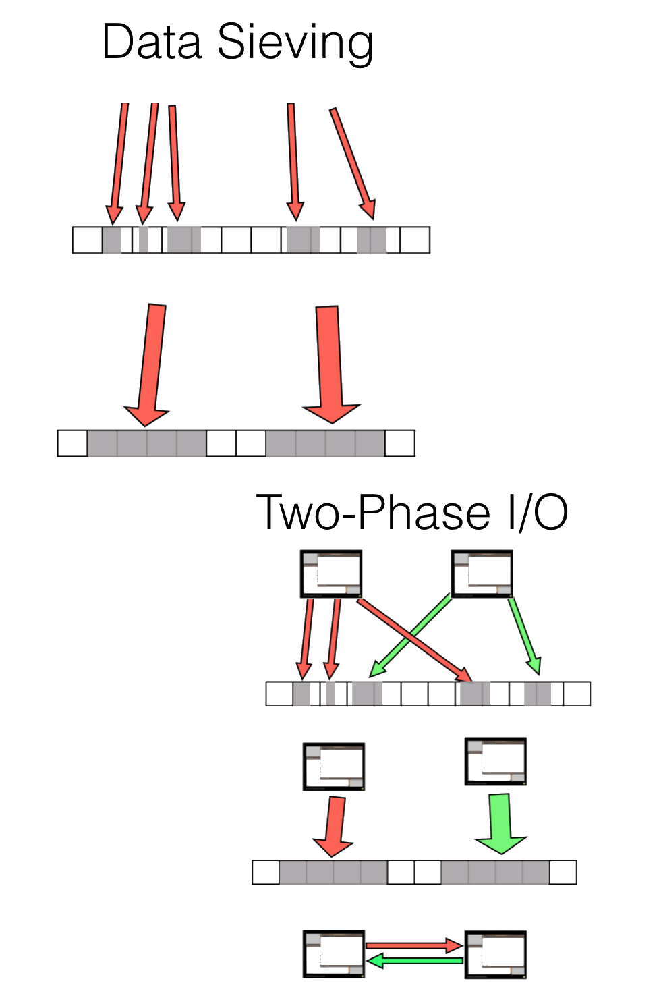

--- 

## We know things can be better, from MPI

These work _extremely_ well.

Before available, how many researchers had to (poorly) re-implement these things themselves?

Nobody suggests now that researchers re-write them at low level &ldquo;for best performance&rdquo;.

Researchers constantly re-implementing mesh data exchanges, distributed-memory tree algorithms, etc. make no more sense.

---

## The Plan

For the rest of our time together, will introduce you to three technologies - one from within HPC, two from without - that I think have promise:

* Chapel - an HPC PGAS language from Cray
* Spark - a data-processing framework, originally out of UC Berkeley
* TensorFlow - data processing for "deep learning", from Google

All of these can be used for some HPC tasks now with the promise of much wider HPC relevance in the coming couple of years.

--- .segue .dark

## Chapel: http://chapel.cray.com

---

## An Very Quick Intro to Chapel

Chapel was one of several languages funded through DARPA HPCS (High Productivity Computing Systems) 
project. Successor of [ZPL](http://research.cs.washington.edu/zpl/home/).

A PGAS language with global view; that is, code can be written as if there was only one thread (think OpenMP)

```
config const m = 1000, alpha = 3.0;

const ProblemSpace = {1..m} dmapped Block({1..m});

var A, B, C: [ProblemSpace] real;

B = 2.0;
C = 3.0;

A = B + C;
```

`$ ./a.out --numLocales=8 --m=50000`

---

## Domain Maps

Chapel, and ZPL before it:
* Separate the expression of the concurrency from that of the locality.
* Encapsulate _layout_ of data in a "Domain Map"
* Express the currency directly in the code - programmer can take control
* Allows "what ifs", different layouts of different variables.

--- 

## Domain Maps

What distinguishes Chapel from HPL (say) is that it has these maps for other structures - and user can supply domain maps:


http://chapel.cray.com/tutorials/SC09/Part4_CHAPEL.pdf

--- &twocol

## Playing with Chapel

*** =left

There's a nascent Chapel REPL that you can use to familiarize yourself with the type system, etc, 
but you can't do any real work with it yet; it's on the VM as `chpl-ipe`.

*** =right

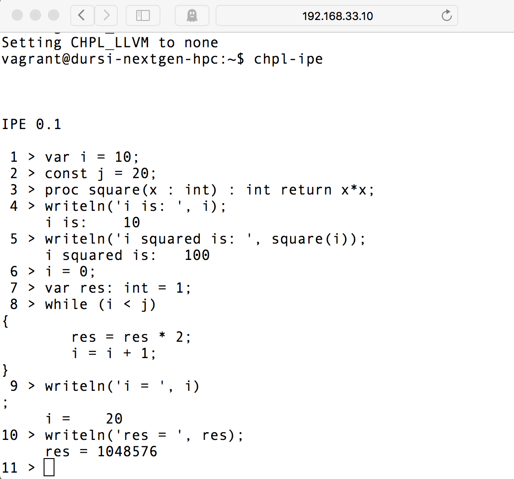

--- 
## Jacobi

Running the Jacobi example shows a standard stencil-on-regular grid calculation:

```
$ cd ~/examples/chapel_examples
$ chpl jacobi.chpl -o jacobi                   
$ ./jacobi                                     
Jacobi computation complete.
Delta is 9.92124e-06 (< epsilon = 1e-05)
# of iterations: 60
```

--- 

## Jacobi

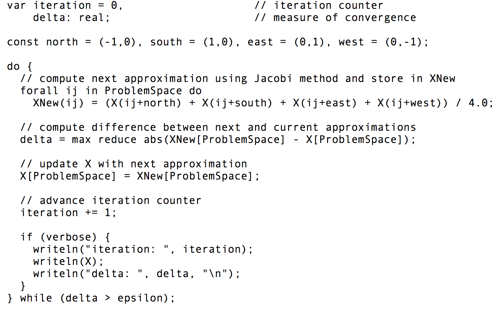

--- 

## Tree Walks

Lots of things do stencils on fixed rectangular grids well; maybe more impressively, Chapel's concurrency primitives allow things like distributed tree walks simply, too:

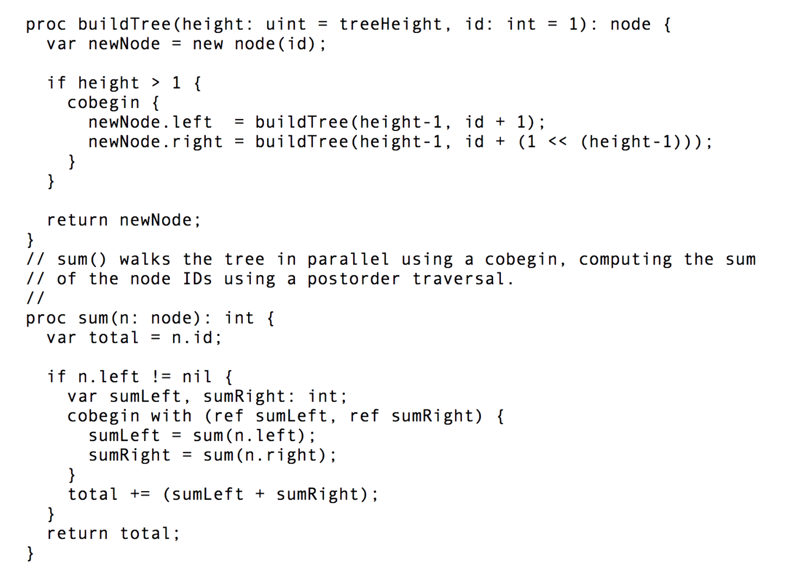

--- 

## Chapel: Caveats

* Compiler still quite slow
* Domain maps are static, making (say) AMR a ways away. 
    * (dynamic associative arrays would be a _huge_ win in bioinformatics)
* Irregular domain maps are not as mature

## Chapel: Pros

* Growing community
* Developers very interested in "onboarding" new projects
* Open source, very portable
* Using mature approach (PGAS) in interesting ways

--- .segue .dark

## Spark: http://spark.apache.com

---

## A Very Quick Intro to Spark

Spark is a "Big Data" technology originally out of the 
[AMPLab at UC Berkeley](https://amplab.cs.berkeley.edu) that is rapidly becoming extremely popular.


---

## A Very Quick Intro to Spark

Hadoop came out in ~2006 with MapReduce as a computational engine, which wasn't that useful for scientific computation.

* One pass through data
* Going back to disk every iteration

However, the ecosystem flourished, particularly around the Hadoop file system (HDFS) and new databases
and processing packages that grew up around it.

--- &twocol

## A Very Quick Intro to Spark

*** =left
Spark is in some ways "post-Hadoop"; it can happily interact with the Hadoop stack but doesn't require it.

Built around concept of resilient distributed datasets

* Tables of rows, distributed across the job, normally in-memory
* Restricted to certain transformations - map, reduce, join, etc
* Lineage kept
* If a node fails, rows recalculated 

*** =right


--- 

## More than just analytics

Don't need to justify Spark for those analyzing large emounts of data:
* Already widely successful for large-scale data processing

Want to show how close it is to being ready to use for more traditional
HPC applications, too, like simulation:
* Simulation is "data intensive", too.


--- &twocol

## Spark RDDs

*** =left

Spark RDDs prove to be a very powerful abstraction.

Key-Value RDDs are a special case - a pair of values, first is key, second is value associated with.

Can easily use join, etc to bring all values associated with a key together:
  - Like all terms that are contribute to a particular point
  
Linda tuple spaces, which underly Gaussian.

Notebook: Spark 1 - diffusion

*** =right
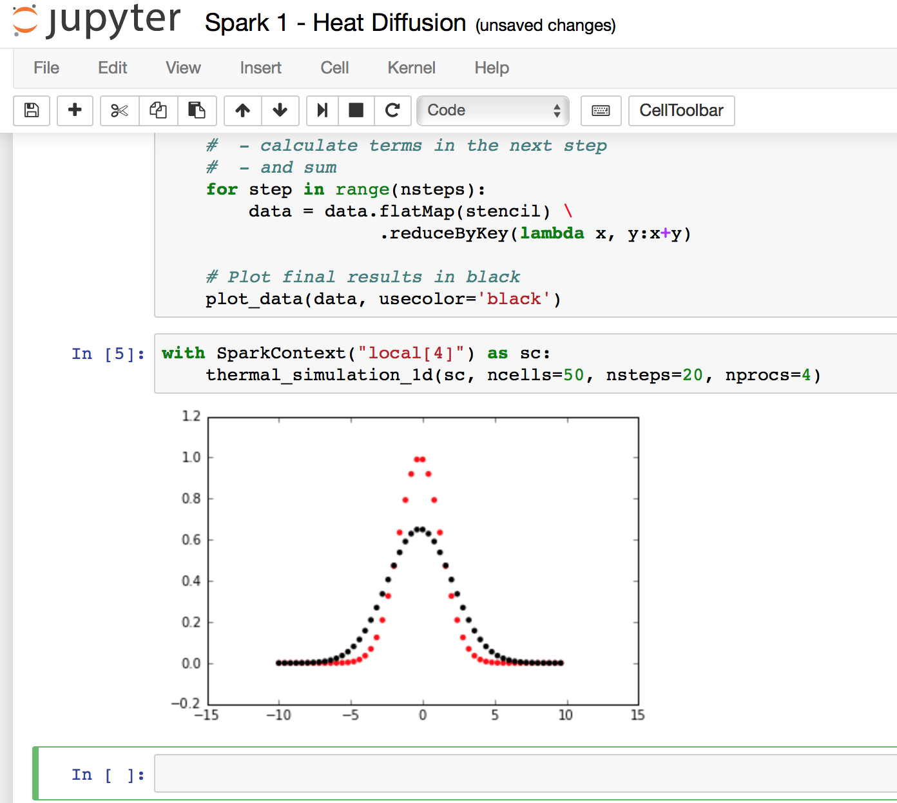

--- &twocol

## Spark execution graphs

*** =left

Operations on Spark RDDs can be:
* Transformations, like map, filter, join...
* Actions like collect, foreach, ..

You boild a Spark computation by chaining together operations; but no data starts moving until part of the computation is materialized with an action.

Allows optimizations over the entire computation graph.

*** =right


--- 

## Spark execution graphs

So for instance here, nothing starts happening in earnest until the `plot_data()`

```
    # Main loop: For each iteration,
    #  - calculate terms in the next step
    #  - and sum
    for step in range(nsteps):
        data = data.flatMap(stencil) \
                    .reduceByKey(lambda x, y:x+y)
            
    # Plot final results in black
    plot_data(data, usecolor='black')
```

--- &twocol

## Spark Dataframes

*** =left
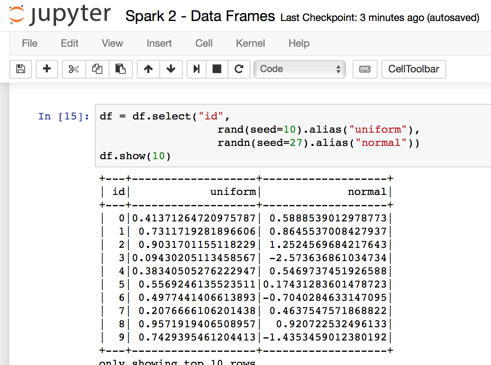

*** =right

But RDDs are also building blocks.

Spark Data Frames are lists of columns, like pandas or R data frames.

Can use SQL-like queries to perform calculations.  But this allows bringing the entire mature machinery of SQL query optimizers to bear, allowing further automated optimization of data movement, and computation.


Notebook: Spark 2 - data frames

--- &twocol

## Spark Graphs - GraphX

*** =left

Using RDDs, a graph library has also been implemented: GraphX.

Many interesting features, but for us: [Pregel](http://blog.acolyer.org/2015/05/26/pregel-a-system-for-large-scale-graph-processing/)-like algorithms on graphs.

Nodes passes messages to their neighbours along edges.

Like MPI (BSP) on unstructured graphs!

*** =right
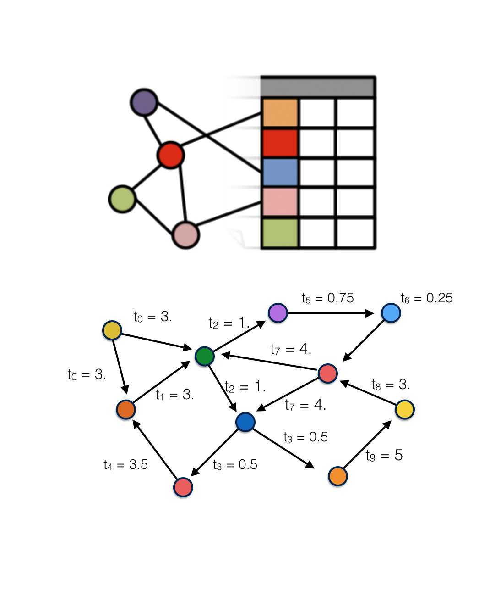

--- &twocol

## Spark Graphs - GraphX

*** =left

Maddeningly, graph algorithms are not yet fully available from Python - in particular, Pregel.

Can try to mock communications up along edges of an unstructured mesh, but unbelievably slow.

Still, gives a hint what's possible.

*** =right
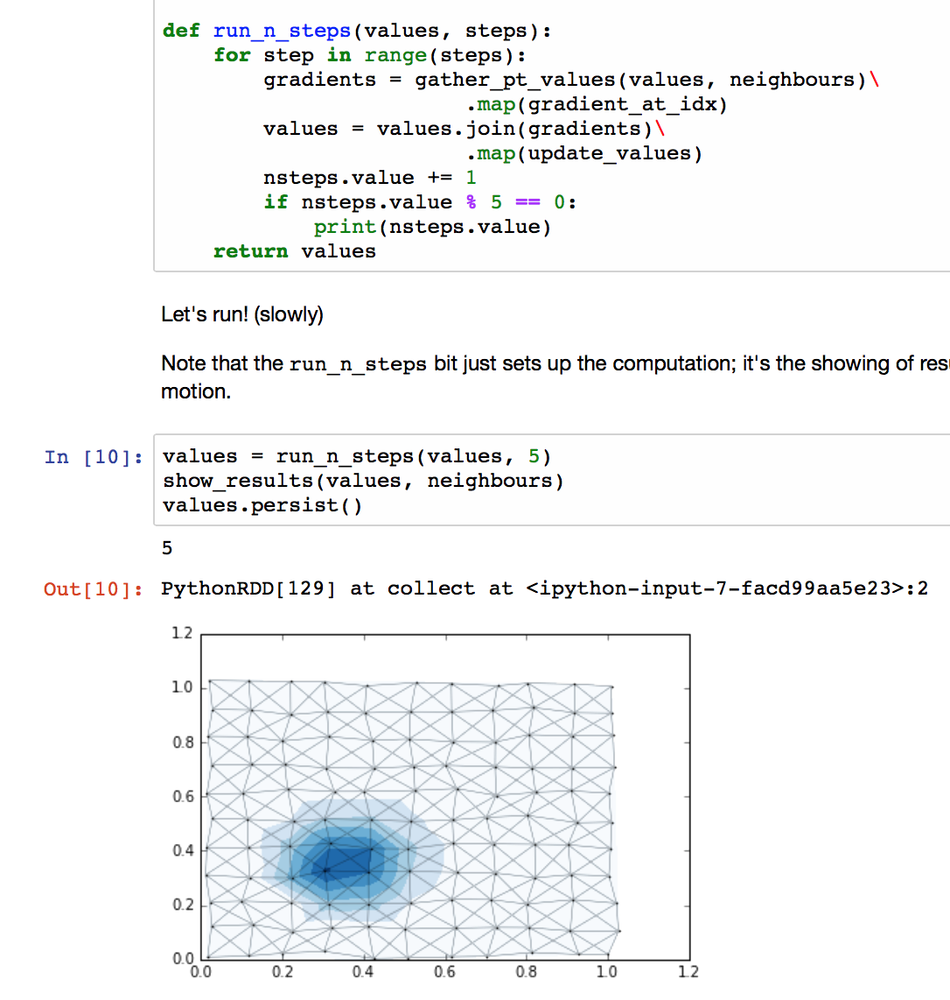

Notebook: Spark 3 - Unstructured Mesh

--- 

## Spark's Capabilities

For data analysis, Spark is already there - like parallel R without the headaches and with a growing level of packages.

Lots of typical statstics + machine learning.

For traditional high performance computing, seems a little funny so far: Scalapack-style distributed block matricies are there, with things like PCA, but not linear solves!  

Graph support will enable a lot of really interesting applications (Spark 2.x - this year?)

Very easy to set up a local Spark install on your laptop.

--- 

## Spark Cons

JVM Based (Scala) means C/Python interoperability always fraught.

Not much support for high-performance interconnects (although that's coming from third parties - [HiBD group at OSU](http://hibd.cse.ohio-state.edu))

Very little explicit support for multicore yet, which leaves some performance on the ground.

--- .segue .dark

## Tensorflow: http://tensorflow.org

--- &twocol

## A Quick Intro to TensorFlow

*** =left

TensorFlow is an open-source dataflow for numerical computation with dataflow graphs, where the data is always in the form of tensors (n-d arrays).

From Google, who uses it for machine learning.

Heavy number crunching, can use GPUs or CPUs, and will distribute tasks of a complex workflow across resources.

(Current version only has initial support for distributed; taking longer to de-google the distributed part than anticipated)

*** =right


http://www.tensorflow.org

--- &twocol

## TensorFlow Graphs

*** =left

As an example of how a computation is set up, here is a linear regression example.

Linear regression is already built in, and doesn't need to be iterative, but this example is quite general and shows how it works.

Variables are explicitly introduced to the TensorFlow runtime, and a series of transformations on the
variables are defined.

When the entire flowgraph is set up, the system can be run.

The integration of tensorflow tensors and numpy arrays is very nice.


*** =right
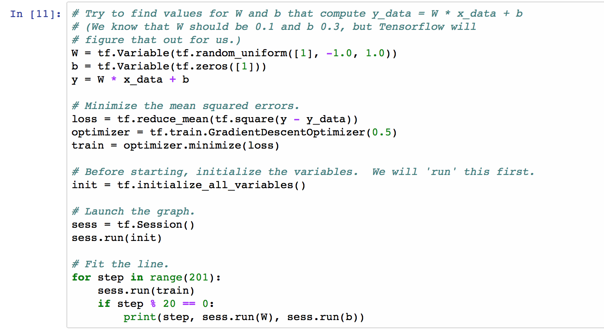
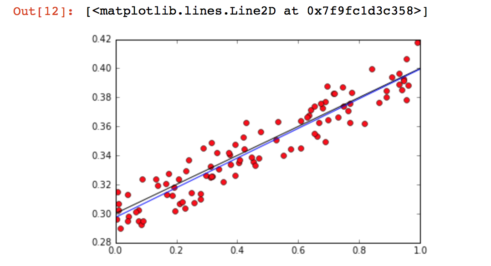

--- &twocol

## TensorFlow Mandelbrot

*** =left

All sorts of computations on regular arrays can be performed.

Some computations can be split across GPUs, or (eventually) even nodes.

All are multi-threaded.

*** =right
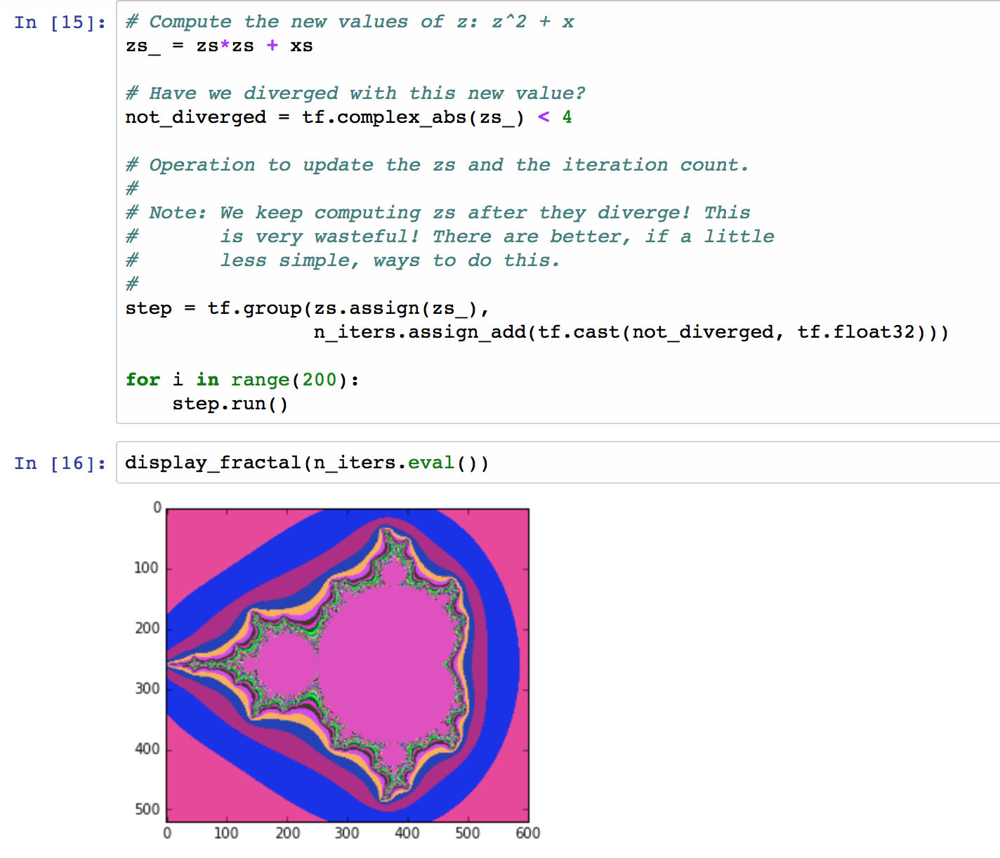

--- &twocol

## TensorFlow Wave Equation

*** =left

All sorts of computations on regular arrays can be performed.

Some computations can be split across GPUs, or (eventually) even nodes.

All are multi-threaded.

*** =right
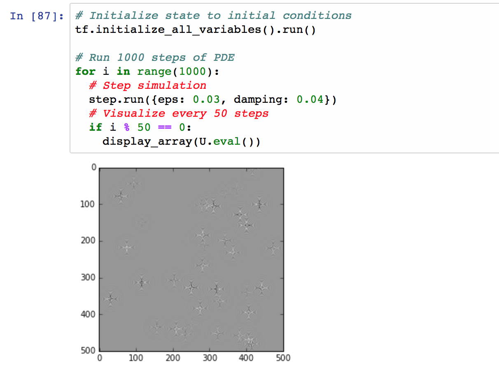


---

## TensorFlow: Caveats

* Tensors only means limited support for, eg, unstructured meshes, hash tables (bioinformatics)
* Distribution of work remains limited and manual (but is expected to improve - Google uses this)

## TensorFlow: Pros

* C++ - interfacing is much simpler than 
* Fast
* GPU, CPU support, not unreasonble to expect Phi support shortly
* Great for data processing, image processing, or computations on n-d arrays

--- .segue .dark

## Conclusions

---

## Building an Execution Plan for a Better Tomorrow

All of the approaches we've seen implicitly or explicitly constructed dataflow graphs to describe where data needs to move.

Then can build optimization on top of that to improve data flow, movement; optimization often leaves room for improvement.

These approaches are extremely promising, and already completely useable at scale for some sorts of tasks.

None will replace MPI yet, but any have the opportunity to make some work much more productive, and reduce time-to-science
