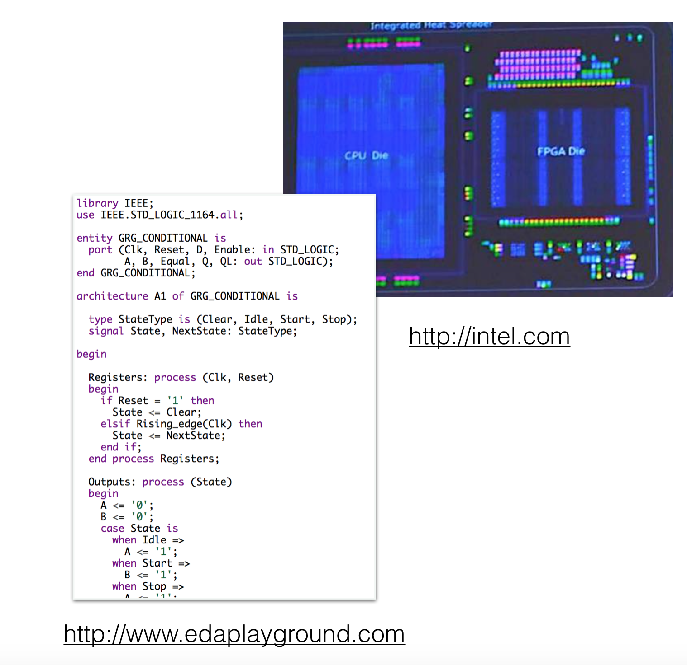
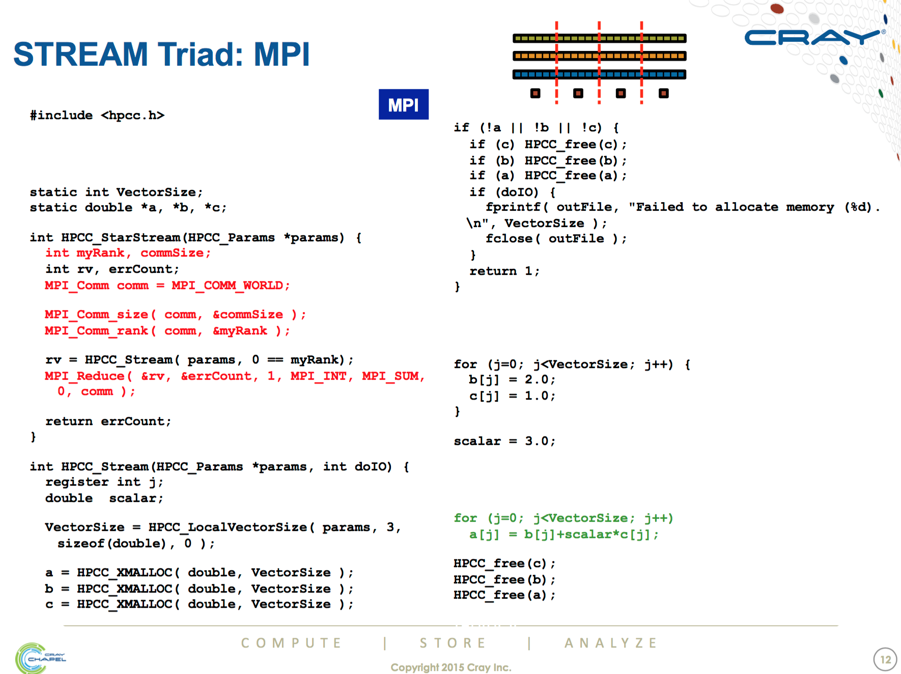
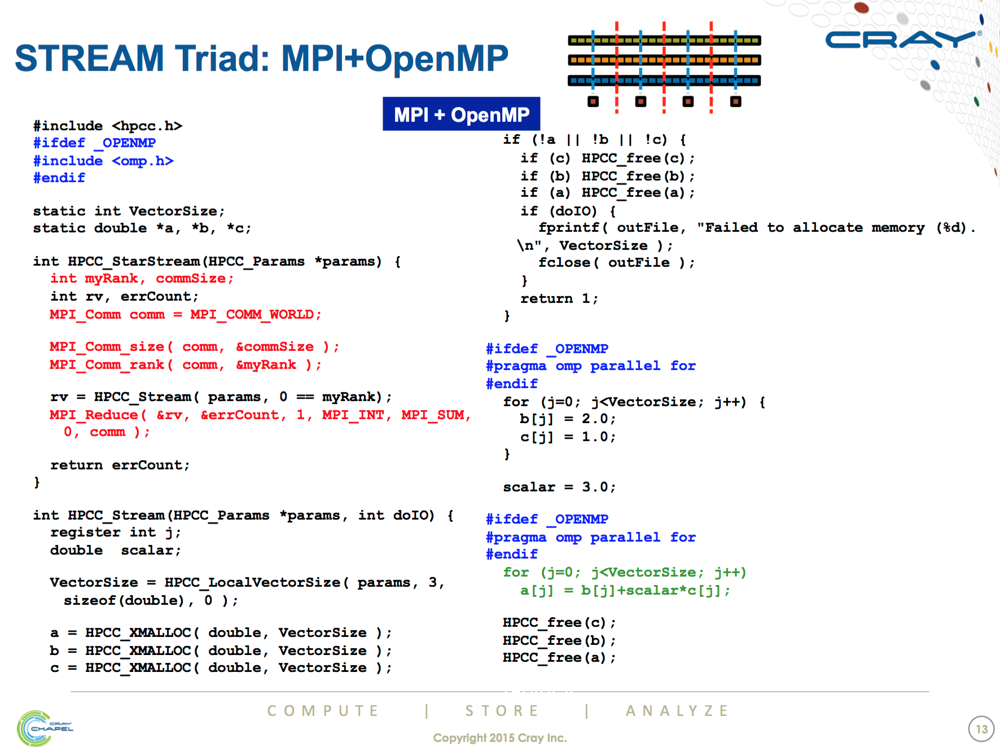
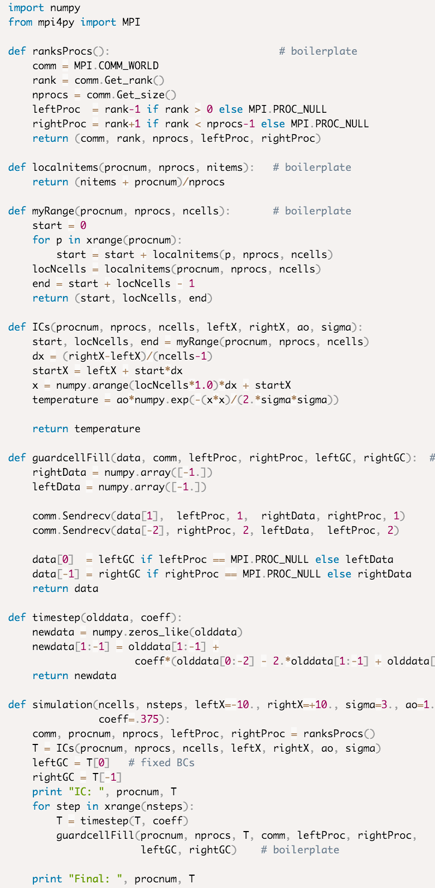
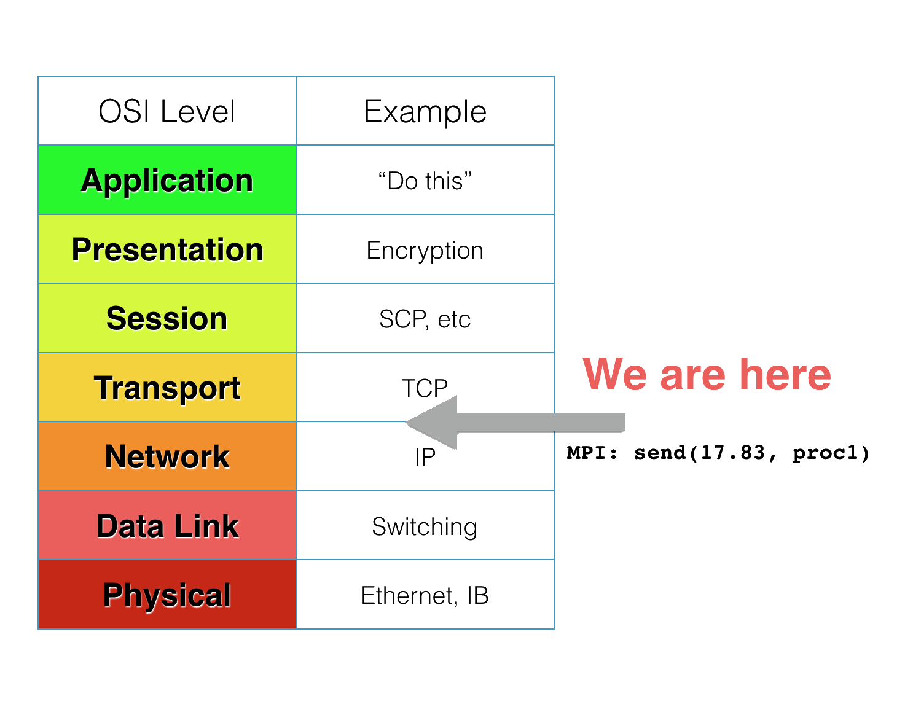
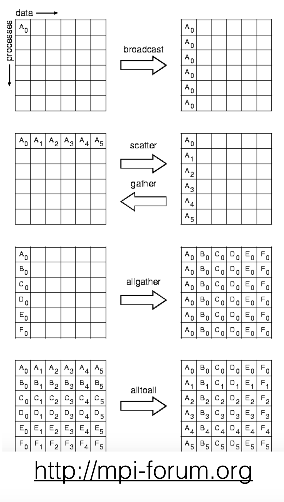
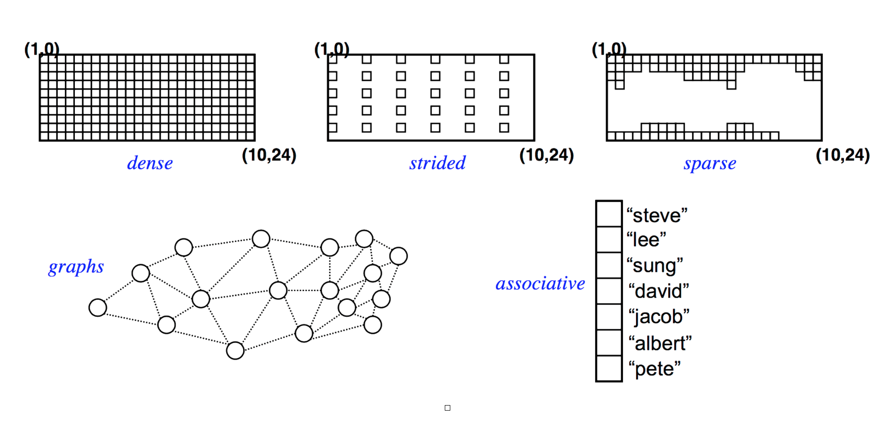

<style type="text/css">
.title-slide {
  background-color: #EDEDED; 
}
article p {
  text-align:left;
}
p {
  text-align:left;
}
ul li {
  text-align:left;
}
img {     
  max-width: 90%;
  max-height: 90%;
  vertical-align: middle;
}
</style>

<script type="text/javascript" src="http://ajax.aspnetcdn.com/ajax/jQuery/jquery-1.7.min.js"></script>
<script type="text/javascript">
$(function() {     
  $("p:has(img)").addClass('centered'); 
  });
</script>
 

## Exciting Time to be Doing Large-Scale Scientific Computing

Large scale scientific computing, 1995-2005 (ish):

* ~20 years of stability
* Bunch of x86, MPI, ethernet or infiniband
* No one outside of academia was much doing big number crunching

--- &twocol

## New Communities Make things Exciting!

*** =left

* Internet-scale companies (Yahoo!, Google)
* Very large-scale image processing
* Machine learning:
  * Sparse linear algebra
  * k-d trees
  * Calculations on unstructured meshes (graphs)
  * Numerical optimization
* Building new frameworks

*** =right


--- &twocol

## New Hardware Makes things Exciting!

*** =left

* Now:
  * Large numbers of cores per socket
  * GPUs/Phis
* Next few years:
  * FPGA (Intel: Broadwell + Arria 10, shipping 2017)
  * Non-volatile Memory (external memory/out-of-core algorithms)

*** =right



---

## New Hardware Makes things Exciting?



---

## New Hardware Makes things Exciting?



---

## New Hardware Makes things Exciting?


---

## Programming Time is More Precious Than Compute


--- &twocol

## Programming Time is More Precious Than Compute

*** =left

And this only becomes more pronounced with other trends which make scientific programming harder:

* New variations of hardware
* New science demands: cutting edge models are more complex.  An Astro example:
    * 80s - gravity only N-body, galaxy-scale
    * 90s - N-body, cosmological
    * 00s - Hydrodynamics, cosmological
    * 10s - Hydrodynamics + rad transport + cosmological
    
*** =right


--- &twocol

## Things are currently harder than they have to be

*** =left

_Computational_ scientists have learned a lot about _computer_ science in the last 20+ years.
* Encapsulation
* Higher level programming languages (_e.g._, python-as-glue)
* Code collaboration, sharing (github, etc)
* Division of labour - more distinction between people who work on libraries and people who build software that implements a scientific model

*** =right



--- &twocol

## We're programming at the transport layer...

*** =left

But our frameworks are letting us down.

MPI, which has served us very well for >25 years, is 90+% low level.  
* "Send 100 floats to task 7"
* Close to a network-agnostic sockets API (So maybe network level)
    - But a sockets API where everyone's browser crashes if a web server goes down.
* Assumptions made to make it easy for scientists to directly program in make it very difficult to build general frameworks upon (new MPI-3 one-sided stuff being an honourable exception)

*** =right



--- &twocol

## When we want to think about models, systems

*** =left

Programming at that level is worse than just hard.
* Makes the code very resistant to change.
* Changing how the data is distributed means completely rewriting every line of code that assumes the current distribution, communications pattern.
* &ldquo;I have an idea! I _think_ it will speed up the code 25%!  But it means rewriting 50,000 lines of code.&rdquo;
    - \#ExperimentsThatWillNeverHappen
* Makes it hard to take advantage of the opportunities new technologies present.

*** =right


---

## We know things can be better, from...

There have been many projects from within scientific computing that have tried to provide a higher-level approach - most have not been wildly successful.

* Many were focussed to specifically on one kind of problem (HPF)
* Or solved one research group's problems but people working in other areas weren't enthusiastic (Charm++)

But new communties are reawakining these efforts with the sucesses they're having with their approaches.

And we know we can have _both_ high performance and higher-level primitives from a parallel library I use pretty routinely.  

It's called MPI.

--- &twocol

## We know things can be better, from MPI

*** =left

**Collective** operations - scatter, gather, broadcast, or interleave data from all participating tasks.

Are implemented with:
* Linear sends
* Binary trees
* Split rings
* Topology aware
...

Make decisions about which to use size of communicator, size of message, etc without researcher intervention.

Can influence choice with implementation-dependant runtime options.

*** =right




--- &twocol

## We know things can be better, from MPI

*** =left
**Parallel I/O** operations - interacting with a filesystem

Many high-level optimizations possible 
* Data sieving
* Two-phase I/O
* File-system dependant optimizations

Algorithmic decisions made at run time, with researcher only able to issue 'hints' as to behaviour

*** =right


--- 

## We know things can be better, from MPI

These work _extremely_ well.

Before available, how many researchers had to (poorly) re-implement these things themselves?

Nobody suggests now that researchers re-write them at low level &ldquo;for best performance&rdquo;.

Researchers constantly re-implementing mesh data exchanges, distributed-memory tree algorithms, etc. make no more sense.

---

## The Plan

For the rest of our time together, will introduce you to three technologies - one from within HPC, two from without - that I think have promise:

* Chapel - an HPC PGAS language from Cray
* Spark - a data-processing framework, originally out of UC Berkeley
* TensorFlow - data processing for "deep learning", from Google

All of these can be used for some HPC tasks now with the promise of much wider HPC relevance in the coming couple of years.

--- .segue .dark

## Chapel: http://chapel.cray.com

---

## An Very Quick Intro to Chapel

Chapel was one of several languages funded through DARPA HPCS (High Productivity Computing Systems) 
project. Successor of [ZPL](http://research.cs.washington.edu/zpl/home/).

A PGAS language with global view; that is, code can be written as if there was only one thread (think OpenMP)

```
config const m = 1000, alpha = 3.0;

const ProblemSpace = {1..m} dmapped Block({1..m});

var A, B, C: [ProblemSpace] real;

B = 2.0;
C = 3.0;

A = B + C;
```

`$ ./a.out --numLocales=8 --m=50000`

---

## Domain Maps

Chapel, and ZPL before it:
* Separate the expression of the concurrency from that of the locality.
* Encapsulate _layout_ of data in a "Domain Map"
* Express the currency directly in the code - programmer can take control
* Allows "what ifs", different layouts of different variables.

--- 

## Domain Maps

What distinguishes Chapel from HPL (say) is that it has these maps for other structures - and user can supply domain maps:



http://chapel.cray.com/tutorials/SC09/Part4_CHAPEL.pdf

--- .segue .dark

## Spark: http://spark.apache.com

---

## An intro to Spark

--- .segue .dark

## Tensorflow: http://tensorflow.org

---

## An intro to TensorFlow

--- .segue .dark

## Conclusions

---
